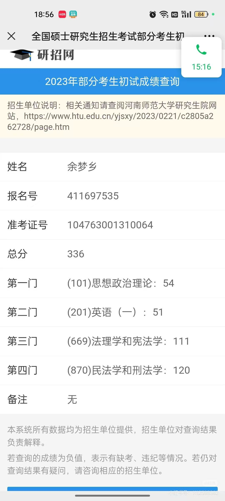

  

    <h1>成绩查询系统用户指南</h1>
    

      本页用于指导用户完成资格码绑定、本地后台配置、成绩查询及常见问题排查。
      首次使用建议按下方“快速开始”顺序操作。
    

  

  

    <h2>快速开始</h2>
    <ol>
      <li>打开成绩查询主页，进入后台。</li>
      <li>输入资格码并完成绑定确认。</li>
      <li>在本地后台填写学校、报名号、科目名称与分数并保存。</li>
      <li>回到查询页，输入姓名、证件号码、准考证号进行查询。</li>
      <li>若资格码不可用，可在下方提交订单号申请补充资格码。</li>
    </ol>
  

  

    <h2>页面示例（图文）</h2>
    

      

        
        
查询页：输入姓名、证件号码、准考证号。

      

      

        
        
结果页：展示报名号、总分和各科成绩。

      

    

  

  

    <h2>额外资格码申请</h2>
    

      接口：<code>POST /api/v1/codes/claim-extra</code> 
      说明：为防止滥用，申请时需要填写订单号。当前页面校验格式为 <code>P + 18位数字</code>，例如：
      <code>P787800186541310451</code>。
    

    

      <label for="apiBaseInput">API 地址</label>
      <input id="apiBaseInput" type="text" placeholder="例如：https://xxxx.trycloudflare.com">
    

    

      <label for="orderNoInput">订单号</label>
      <input id="orderNoInput" type="text" maxlength="32" placeholder="例如：P787800186541310451" autocomplete="off">
    

    

      <button id="claimCodeBtn" class="btn">申请新资格码</button>
      <button id="copyCodeBtn" class="btn secondary">复制最新资格码</button>
    

    

  

  

    <h2>常见问题（FAQ）</h2>
    <ol>
      <li>提示“服务暂不可用，请稍后重试”：通常是隧道或网络问题，请确认 <code>API地址/api/v1/health</code> 可访问。</li>
      <li>提示“Code not found”：说明资格码不在当前后端数据中，需在服务器补码后重启 API。</li>
      <li>换设备后原资格码不可用：可申请补充资格码，或让管理员在后台解除绑定后重新配置。</li>
      <li>订单号格式错误：请使用 <code>P + 18位数字</code>（示例：<code>P787800186541310451</code>）。</li>
    </ol>
  

